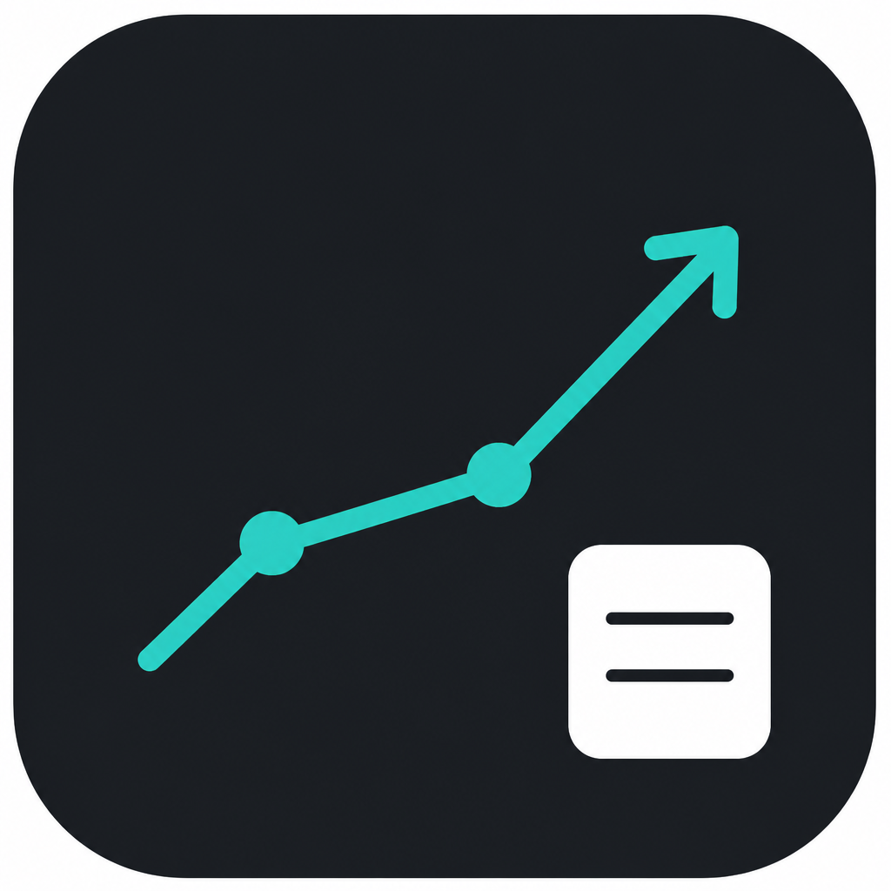
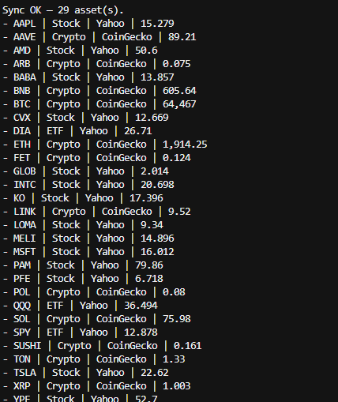
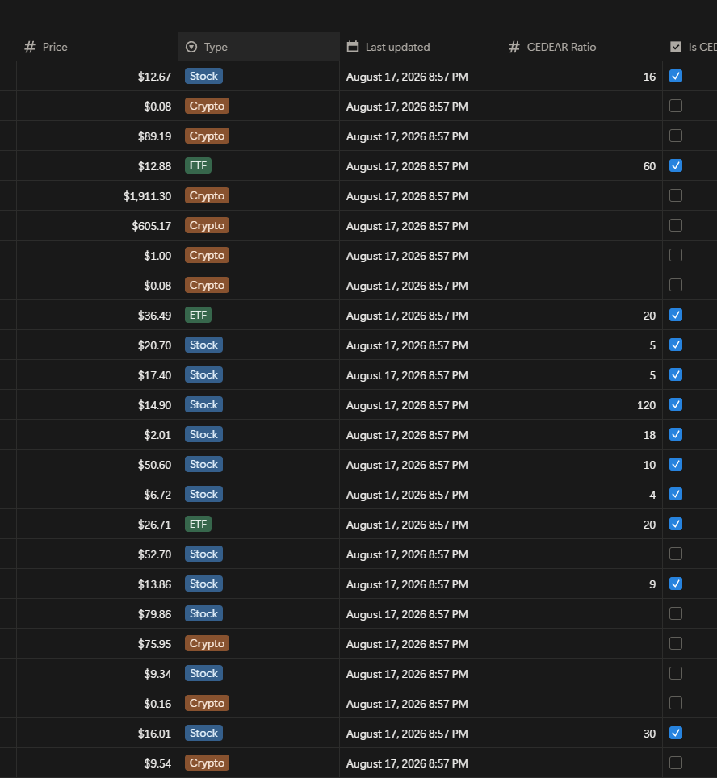

<p align="center">
  
</p>

# asset-prices-viewer

Sync de precios USD (crypto vía CoinGecko, stocks/ETFs vía Yahoo Finance) hacia una base de Notion. Los CEDEARs usan `CEDEAR Ratio` para guardar el precio por certificado.

## Preview

Consola local (`npm run dev`) y la base de precios en Notion después del sync:

<p align="center">
  
  
</p>

## Requisitos

- Node.js 20+
- npm
- Integración de Notion con acceso a la base de precios

## Setup

```bash
git clone https://github.com/<tu-usuario>/asset-prices-viewer.git
cd asset-prices-viewer
npm install
cp .env.example .env
```

Completar `.env` (ver variables abajo). El archivo `.env` está en `.gitignore`.

## Variables de entorno

| Variable | Requerida | Descripción |
| --- | --- | --- |
| `NOTION_TOKEN` | Sí | Token de la integración Notion |
| `NOTION_PRICES_DATA_SOURCE_ID` | Sí | Data source ID (UUID), no la URL de la página |
| `COINGECKO_API_KEY` | No | Key demo/Pro; la API pública funciona sin ella |

Plantilla: `.env.example`.

## Uso

```bash
npm run dev        # sync: lee Notion → precios → escribe Price → imprime
npm run typecheck  # TypeScript sin emitir
npm run build      # compila a dist/
npm start          # ejecuta dist/main.js
```

## GitHub Actions (cron en la nube)

El workflow `.github/workflows/sync-prices.yml` corre `npm run build` + `npm start` cada **15 minutos**, y también se puede disparar a mano.

Los valores reales **no van en el YAML**. Se cargan en el repo: **Settings → Secrets and variables → Actions → New repository secret**.

| Secret | Requerido | Valor |
| --- | --- | --- |
| `NOTION_TOKEN` | Sí | El mismo token que en tu `.env` local |
| `NOTION_PRICES_DATA_SOURCE_ID` | Sí | El UUID de la data source |
| `COINGECKO_API_KEY` | No | Solo si usás key de CoinGecko |

Para probar: pestaña **Actions** → **Sync prices** → **Run workflow**.

## Qué hace el sync

1. Lee assets desde Notion (`Symbol`, `Type`, `Source`, `Price`, `CEDEAR Ratio`).
2. Pide USD a CoinGecko (source `CoinGecko`) y Yahoo (source `Yahoo`) en paralelo. Si un vendor falla, el sync sigue con el otro.
3. Para quotes Yahoo con `CEDEAR Ratio` > 0, convierte a precio por certificado (`USD ÷ ratio`). Crypto y acciones sin ratio quedan en USD crudo.
4. Escribe `Price` solo si cambió; `Last updated` en cada quote fresco del vendor.
5. Lista el resultado en consola.

## Estructura

```text
asset-prices-viewer/
├── .github/
│   └── workflows/
│       └── sync-prices.yml
├── docs/
│   ├── logo.png
│   ├── notion-prices.png
│   └── sync-cli.png
├── src/
│   ├── api/
│   │   ├── utils/
│   │   │   ├── headerBuilder.ts
│   │   │   └── restfulApi.ts
│   │   ├── coinGeckoApi.ts
│   │   ├── yahooFinanceApi.ts
│   │   └── notionAssetsApi.ts
│   ├── _constants/
│   │   ├── coinGeckoApiConstants.json
│   │   ├── notionApiConstants.json
│   │   └── yahooFinanceApiConstants.json
│   ├── controller/
│   │   ├── syncController.ts
│   │   └── managers/
│   │       ├── utils/
│   │       │   ├── marketPriceMappersHelper.ts
│   │       │   └── notionHelper.ts
│   │       ├── notionAssetManager.ts
│   │       ├── coinGeckoManager.ts
│   │       └── yahooFinanceManager.ts
│   ├── model/
│   │   ├── asset.ts
│   │   └── notionProperties.ts
│   ├── envConfig.ts
│   └── main.ts
├── .env.example
├── package.json
├── tsconfig.json
└── README.md
```

## Licencia

MIT
